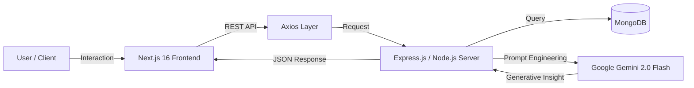

# ScoreX-Showcase
ScoreX ⚽️ 🤖

A modern, AI-powered football companion app. > Combining real-time scores with witty, AI-driven insights.

🔒 Project Status: Closed Source Showcase

Note: This repository serves as a public portfolio showcase. The full source code for ScoreX is currently hosted in a private repository to protect intellectual property.

If you are a recruiter or collaborator interested in the full codebase, please Contact Me directly.

📱 Project Overview

ScoreX is not just another score-keeping app. It is an intelligent companion that contextualizes the game for you. By leveraging Google's Gemini 2.0 Flash, the app understands the nuance of football matches, offering probability insights and conversational engagement that feels like chatting with a knowledgeable friend, not a bot.

🌟 Key Features

| Feature | Description |
|--------|-------------|
| 🧠 **ScoreX AI Assistant** | A conversational agent with a witty “football expert” persona. Capable of answering complex stats questions in real-time. |
| 📊 **AI Insight Bar** | A dynamic visual component predicting Home vs Away win probabilities using generative AI analysis. |
| ⚡ **Real-Time Updates** | Live score architecture using high-frequency polling and optional socket connections. |
| 🎨 **Glassmorphism UI** | Stunning modern UI built with TailwindCSS + Framer Motion for smooth, app-like animations. |
| 📰 **News Ticker** | A scrolling ticker for breaking football news, transfers, and injury updates. |

📸 Interface Previews

[PLACEHOLDER: Add a GIF here showing the AI Chat responding to a user]
Figure 1: ScoreX AI analyzing a match in real-time.

[PLACEHOLDER: Add a Screenshot here of the Main Dashboard/Scoreboard]
Figure 2: The Dashboard featuring the Glassmorphism design system.

🏗 System Architecture

ScoreX utilizes a **decoupled architecture** to ensure the AI service never bottlenecks real-time score feeds.

🛠️ Tech Stack
Frontend: Next.js 16 (App Router), React 19, TailwindCSS, Framer Motion
Backend: Node.js, Express, TypeScript
Database: MongoDB (via Mongoose)
AI Engine: Google Gemini 2.0 Flash (via @google/generative-ai)

💻 Featured Code: AI Persona Injection
While the full codebase is private, here is how ScoreX handles the AI personality injection. The system prompt ensures the model behaves like a passionate football fan instead of a generic assistant.

ts
Copy code
// ScoreX AI Integration Logic (Backend)

// Initialize Gemini with the Flash 2.0 model for low latency
const genAI = new GoogleGenerativeAI(process.env.GOOGLE_API_KEY || '');
const model = genAI.getGenerativeModel({ model: "gemini-2.0-flash" });

router.post('/', async (req, res) => {
    const { message } = req.body;

    // System Prompt: Defines the AI's persona as a witty football expert
    const systemPrompt = `
      You are ScoreX AI, a passionate and knowledgeable football assistant.
      Tone: Enthusiastic, professional, slightly witty.
      Context: The user is on "ScoreX", a modern football scores app.
      User Query: ${message}
    `;

    try {
        const result = await model.generateContent(systemPrompt);
        const response = result.response.text();
        res.json({ response });
    } catch (error) {
        console.error("AI Generation Error:", error);
        res.status(500).json({ error: "VAR Check in progress... (AI Error)" });
    }
});
📬 Contact
Created by Shivam Kumar

Email: shivamkumar060703@gmail.com

LinkedIn: https://www.linkedin.com/in/shivam-void/

Portfolio: https://shivam-void.vercel.app/

© Copyright Notice
The concept, design, and source code of ScoreX are the intellectual property of Shivam Kumar.
Unauthorized copying, modification, distribution, or use of this software is strictly prohibited.
